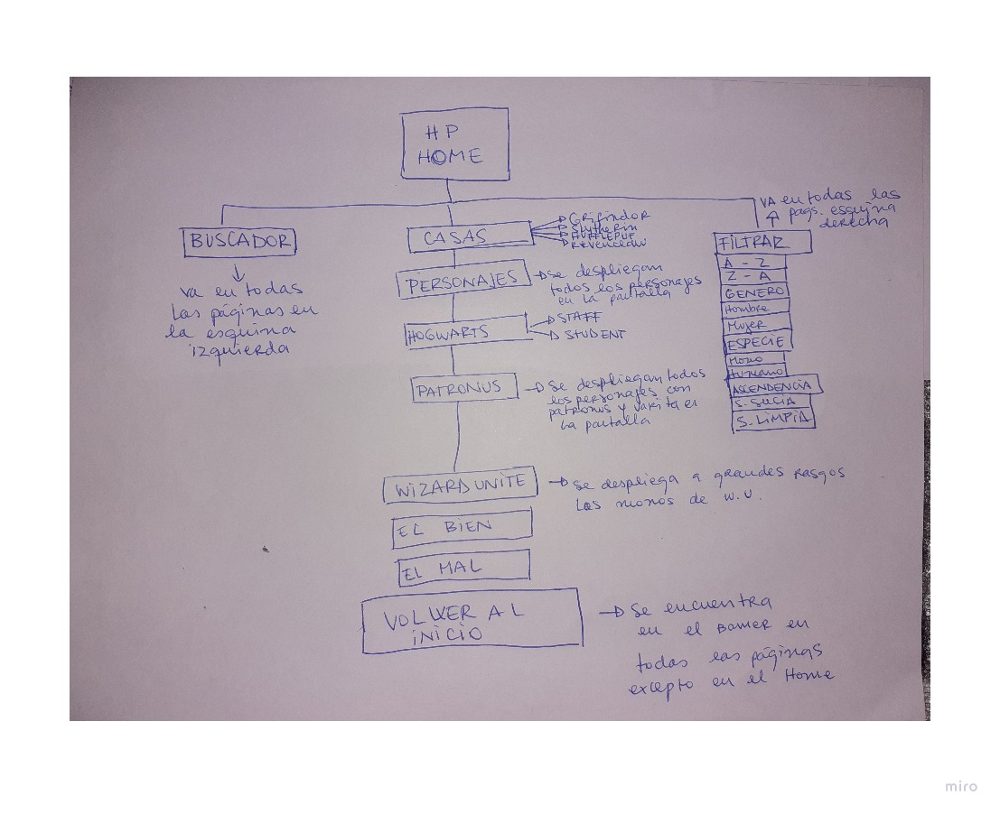
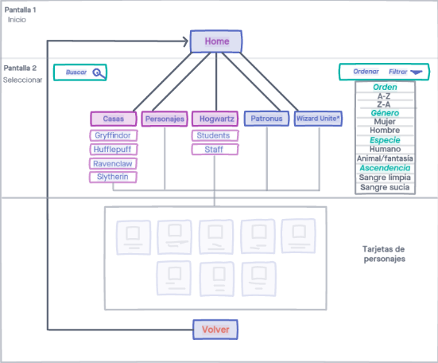
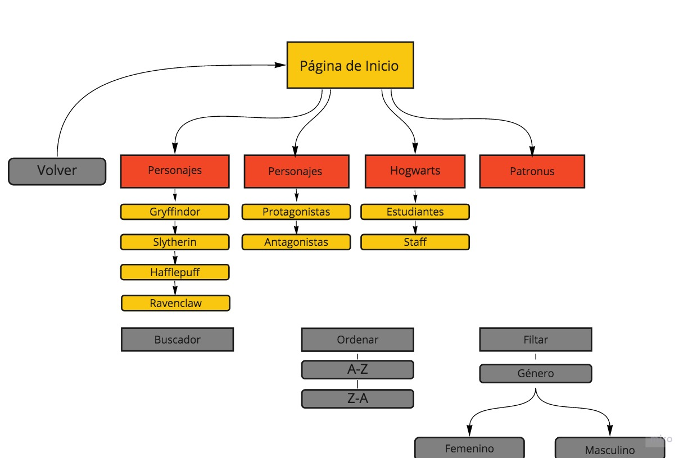
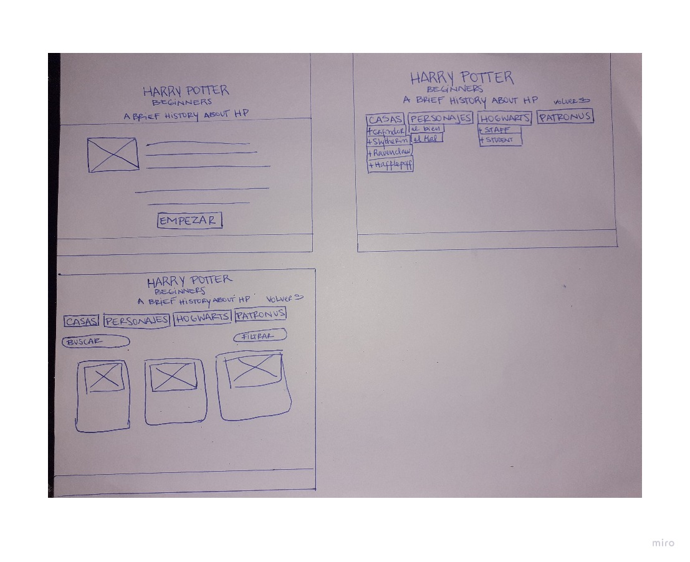
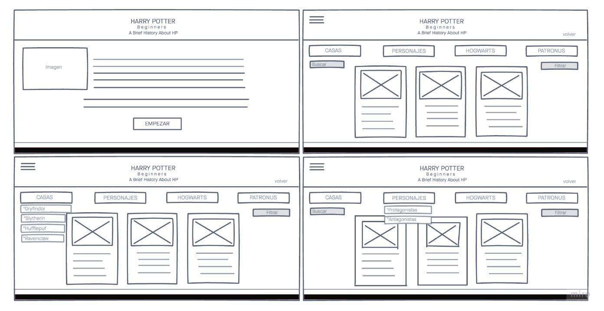
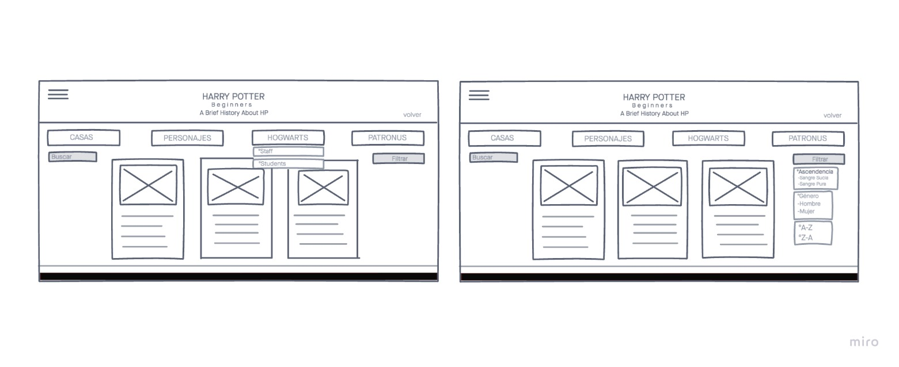
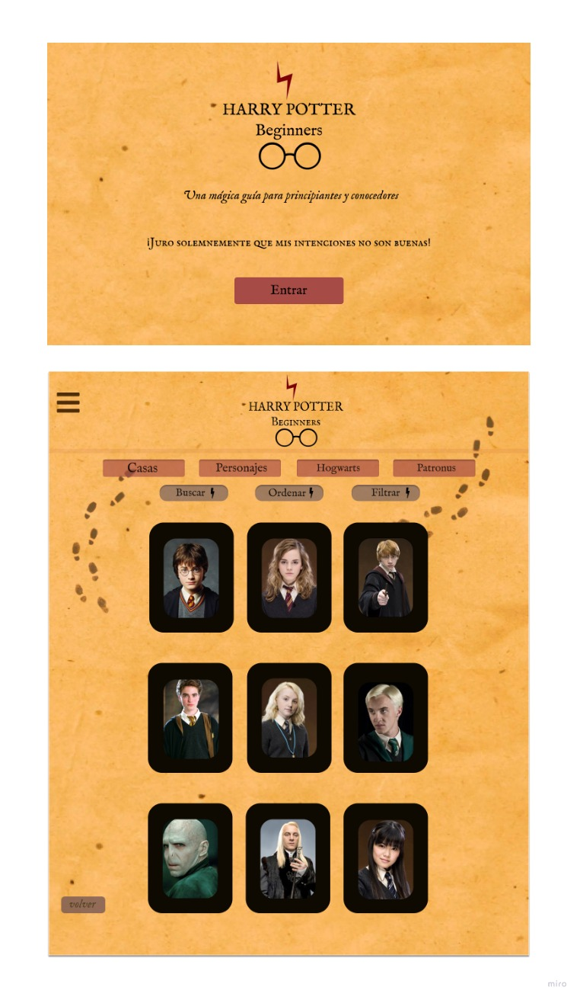

:sparkles:Harry Potter Beginners:sparkles:

## Índice 

* [1. ¿Qué es Harry Potter Beginners?](#intro)
* [2. Una mágica guía](#guía)
* [3. ¿Cómo se construye HP Beginners?](#construcción)
* [4. Experiencia UX](#usuarios)
* [5. Navegación](#navegación)
* [6. Test Unitarios]
* [7. Conclusiones]
* [8. Agradecimientos]
* [9. Checklist](BORRAR DESPUÉS)(#checklist)

***

<a id="intro"> :dizzy: ¿Qué es Harry Potter Beginners? :dizzy: <a>

Harry Potter Beginners, es una app informativa, cuyo enfoque principal es mostrar datos claves para conocer a grandes rasgos, el universo de Harry Potter. Tomando como antecedente la saga de libros y películas de este fantástico mundo. 

***

<a id="guía"> :star: Una mágica guía para principiantes y conocedores. :star: <a>

HP Beginners, se gesta a través de la simple necesidad de nuestros usuarios de conocer más, acerca de este imaginario. Evocando referencias sencillas y poco comunes con respecto a la visualidad del mundo de Harry Potter. En relación a lo anterior proponemos a HP Beginners como "una mágica guía para principiantes y conocedores". Un mini diccionario o guía según lo dice su nombre, en el que puedes acceder fácilmente a un contenido que será un ayuda memoria tanto para los que estén recién conociendo, como para los que ya sean especialistas en el tema.

El objetivo principal de esta web, es mejorar la experiencia de usuario a través de la visualidad y la información que se entregará. Presentamos una plataforma sencilla y de fácil navegación, donde los usuarios podrán a acceder a contenidos como: tips acerca de personajes, casas, filtrar datos, ordenar alfabéticamente, además de tener una vista simple en cuanto imágenes de cada punto mencionado.

Si bien el nombre de esta web "Beginners" genera una relación directa con la categoría de principiante.Consideramos de acuerdo a la opinión de nuestros usuarios, que en esta página somos todos "Beginners" y estamos conociendo un espacio nuevo desde donde pueden nacer nuevas experiencias que se podrán compartir.

***

<a id="construcción"> :hammer: **¿Cómo se construye HP Beginners** :hammer: <a>

Para el desarrollo de esta plataforma, hicimos una investigación previa para entender las necesidades de nuestros usuarios con respecto a la navegación. Acorde a dichas necesidades, construimos un diagrama de flujo en papel que representa una guía hacia lo que luego presentamos como diagrama digital definitivo. según esto definimos una planificación e historias de usuario que fuimos cumpliendo durante cada sprint. Para esto utilizamos las plataformas de "Trello" y "Miro". 

Como se puede apreciar, el primer flujograma contiene indicaciones y características que luego acotamos y mejoramos de acuerdo a la investigación antes mencionada. Así mismo, definimos dos nuevos diagramas de flujo.

Esta imagen corresponde al primer diagrama que digitalizamos sin iteración.

Este flujo corresponde a la iteración del segundo diagrama, el que corregimos según el feedback de nuestro cliente para simplificar la funcionalidad de la plataforma.

[Revisa acá nuestra planificación](https://miro.com/welcomeonboard/UcPQAVRzS00CIXHos62V7Y3bWSURdB5585Fu7NBYcsPXKgyXNmca6mOHkW7sBA3S)

[Revisa acá nuestras historias de usuario](https://trello.com/b/6KMWnkiP/planificaci%C3%B3n-data-lovers)

***

<a id="usuarios"> :two_women_holding_hands: **Nuestros mágicos usuarios.** :two_men_holding_hands: <a>

De acuerdo a nuestra investigación, los libros de Harry Potter siguen siendo dentro de los más vendidos el 2019 según estadísticas. Así también, la saga de películas sigue estando entre las más vistas.

[Estadísticas de Libros](https://es.statista.com/estadisticas/586222/libros-mas-leidos-por-jovenes-por-ventas/)

[Estadísticas de películas](https://es.statista.com/estadisticas/587400/series-de-peliculas-con-mas-ingresos-en-el-mundo/)

Conforme a estos datos y el análisis que se hizo con nuestros usuarios, definimos que existe un rango de edad entre los 13 y los 40 años en la que se origina una relación con el mundo de Harry Potter, lo que se condice directamente con el tiempo en que la saga de libros y películas se estrenan. Se mantiene un vinculo desde la época en que se conoce HP hasta la actualidad. En consecuencia, definimos nuestros usuarios de la siguiente forma:

**Usuarios**

* Usuarios que quieran ver o hayan visto películas de HP. Buscan entender mejor la historia sin tener que leer el libro.
* Personas que comienzan a leer o están leyendo los libros. Buscan complementar conocimientos.
* Usuarios que ya tengan conocimientos de HP. 

**Objetivos del usuario en relación a la web** :mag:

* Obtener referencias acerca del mundo de Harry Potter
* Encontrar información de manera simple y dinámica
* Entender fácil y rápidamente la información

**Datos relevantes que los usuarios han declarado que buscan ver en la interfaz:** :bulb:

* Información y visualidad de las casas a las que pertenecen los personajes.  _(El usuario busca por ejemplo poder elegir una casa a la cual pertenecer según las particularidades de cada una)_

* Personajes principales y características. Cuales son los más relevantes: Protagonistas/Antagonistas. _(El usuario busca encontrar una afinidad con los personajes de acuerdo a sus personalidades e identidades)_

* Ocupaciones o profesiones en Hogwarts. _(El usuario busca diferenciar entre estudiantes o staff)_

* Acceder a un glosario de palabras/hechizos/criaturas entre otros. _(El usuario busca entender palabras que aparecen en los libros y películas)_ Es importante aclarar que este punto, está pensado como una mejora de la plataforma, ya que no necesariamente será implementada ahora. :point_left:

**Los usuarios accederían a esta web en los siguientes contextos:** :computer:

Usuarios Principiantes: Accederían para poder aclarar dudas al momento de estar viendo las películas o libros. Para poder entender la historia y ahorrar tiempo en el proceso de esta introducción al mundo HP.

Usuarios avanzados: Estos usuarios acceden a la página para encontrar una guía visual y ayuda memoria con respecto a la historia en general, o las características particulares de los personajes. De otro modo accederían con el fin de buscar curiosidades o información que no se muestra en las películas o no queda clara en el libro.

:art: **Prototipado** :art: 

Teniendo listo y dispuesto el paso anterior, comenzamos a crear nuestro prototipo de baja fidelidad en papel y luego el wireframe en "Invision", con correcciones agregadas.

**Acá nuestro prototipo de baja en papel**

**Acá nuestro Wireframe**

[Puedes ver acá nuestro prototipo de baja en Invision](https://carladaz131271.invisionapp.com/console/datalovers-ck9vt16ow0jvq019dnpudp659/ck9vt2cp70d670198dakkosgp/play)

Pese a que como se observa en la imagen y link de prototipo anterior, habíamos propuesto un título en particular. Recibimos feedback de nuestros usuarios y de nuestro cliente, enfocado a que debíamos decidir si la web se presentaría en español o en inglés, ya que en efecto, era confuso que se mostrara en dos idiomas. En consecuencia se decidió mantener el título fusionando dichos idiomas, a modo de referencia con las raíces del mundo de Harry Potter, pero también presentándolo en un breve concepto, de manera que nos apropiáramos del proceso. Desde aquí comenzamos construir nuestro prototipo de alta en "Figma", con correcciones agregadas.

Con respecto a la visualidad, elegimos imágenes que hacen referencia a ciertos objetos importantes en el mainstream de Harry Potter. El fondo principal de la plataforma se propone como una relación directa a "El mapa del merodeador", así como también la frase que se muestra al principio: "Juro solemnemente que mis intenciones no son buenas". 

En cuanto a la gama cromática, utilizamos el patrón de colores de la casa "Gryffindor", ya que la mayoría de nuestros usuarios declararon ser fanáticos de esta casa mágica. Si bien son dos colores, creemos que son los suficientes para mantener una visual elegante y distintiva, con el fin de no interferir con el resto de la información que se muestra. Lo anterior, se plantea entendiendo que es necesario utilizar tonalidades en imágenes y textos que deben combinar con la gama cromática antes mencionada. Todas la imágenes que utilizamos, son proporcionadas por internet, cabe destacar que las intervenimos en Photoshop para incluir detalles que inyectaran nuestra identidad. Dicho esto, nuestro principal objetivo es salirnos del imaginario típico de HP. Recibimos mucho feedback con respecto a las imágenes, en relación a esto, nos gustaría a futuro mejorar la página y utilizar una visualidad mucho más pictórica. 

[Acá puedes ver nuestro prototipo de alta](https://www.figma.com/proto/QKLnIJxhSDmVPBpiDhyRbW/Harry-Potter-Beginners?node-id=1%3A5&viewport=-2488%2C268%2C0.48059552907943726&scaling=contain)

En el prototipo de alta, redefinimos detalles y agregamos todos los cambios que consideramos, nuevamente según nuestros usuarios y nuestro cliente. Desde aquí comenzamos los test de usabilidad, construimos una especie de esquema que serviría como guía para realizar las entrevistas de usuario. [Revisa nuestro esquema acá](https://miro.com/welcomeonboard/lFcJteX8Zh9qfVjBasqfSheNaGaI5CiNnRQcmrnsWYyNZnLAdxiTYzNN4pGGWSqv)

**Feedback y conclusiones**

De nuestras entrevistas de usuario con respecto a los testeos e iteraciones. Aclaramos de un principio, que los que se les muestra es un prototipo, por lo tanto no correspondería directamente a la funcionalidad real de la plataforma, si no que se les presenta como un maqueta para que como usuarios puedan interactuar. 

Hicimos testeos en 9 usuarios y concluimos lo siguiente:

* Los usuarios valoran que la visualidad sea diferente a la típica de HP.
* Consideran que no contiene toda la información que les gustaría ver, pero muestra datos relevantes.
* Proponen que la plataforma sea más interactiva, ya que a ratos se hace monótona.
* Pocos habían visto una web como esta.
* Declaran que la navegación es fácil y cómoda.
* Los usuarios principiantes, entienden fácilmente la información y efectivamente aclaran dudas, lo que provoca una mayor curiosidad.
* Los usuarios conocedores, proponen que les gustaría ver por ejemplo: arboles genealógicos de cada familia, datos desconocidos que también despierten mayos curiosidad.
* La mayoría de los usuarios, consideran que la información no está correcta, ya que hay algunos detalles de la data que no corresponden a la realidad.

Para complementar esta investigación, y a modo de nueva estrategia, ya que el link de figma falló bastante durante los testeos, incluimos algunas misiones en "Maze", para poder realizar una interacción efectiva y confirmar conclusiones. Puedes revisar [acá el resultado](https://maze.design/r/7c89cafyk9sgm8nd)

En relación a los resultados de maze, comenzamos construir nuestro código. Decidimos acotar aún más las categorías en el menú, ya que cierta información que propusimos en un principio, no se encuentra en la data. 

((((((((((PONER ACÁ EL RESULTADO FINAL DE LA PÁGINA))))))))))

***

 <a id="navegación"> :rowboat: **Navegación** :rowboat: <a>

Como consecuencia de nuestra investigación, definimos la navegación y manejo de la plataforma en dos slide funcionales. 

**Slide uno o Página de inicio**

En este slide podemos visualizar lo siguiente
* Título y logo de la página
* Un párrafo de texto que se presenta como un subtitulo
* Otro párrafo de texto que alude directamente a una frase proveniente del mundo de Harry Potter
* Un botón **"Entrar"** que permite acceder al siguiente slide

**Slide dos o Apendice con funcionalidad principal**
En este Slide visualizamos el funcionamiento principal de la plataforma. Esto se detalla en lo siguiente.
* Header con logo de la página
* Menús desplegables que contienen la siguiente información. 
    * **"Casas"**. al clickear este menú se despliegan los items: **"Gryffindor", "Slytherin", "Hafflepuff", "Ravenclaw"**. Al clickear cada item, se muestran los personajes correspondientes a cada casa.
    * **"Personajes"**. Al clickear este menú se despliegan los items: **"Protagonistas", "Antagonistas"**. Al clickear cada item, se muestran los personajes correspondientes a cada categoría.
    * **"Hogwarts"**. Al clickear este menú se despliegan los items: **"Estudiantes", "Staff"**. Al clickear cada item, se despliegan los personajes correspondientes a cada categoría.
    * **"Patronus"**. Al clickear este menú, se despliegan todos los patronus que se encuentran en la data brindada por el cliente.
* Abajo de lo descrito anteriormente, se muestran tres items donde se puede visualizar el filtrado.
    * **"buscar"**. Corresponde al buscador de información. Aquí se puede buscar cada contenido perteneciente a la data.
    * **"Ordenar"**. Al clickear este menú, se despliegan dos items: **"A-Z" y "Z-A"**. Al clickear cada uno, mostrará los personajes ordenados alfabéticamente.
    * **"Filtrar"**. Al clickear este menú, se despliegan un item: **"Género"**, que contiene dos sub items **"Femenino"**, **Masculino**. Al clickear cada uno, se muestran los personajes masculinos y femeninos respectivamente.
* En conjunto con lo anterior, se muestra la información de cada personaje junto con una imagen que los representa, éstas se encuentran en un contenedor o tarjeta con atributos visuales. Estos se muestran siempre en la pantalla. Al posicionar el mouse sobre cada uno, la tarjeta se gira y se exponen las características de los personajes ya mencionados. 
* Botón **"Volver"**. Este botón nos lleva directamente a la página de inicio o slide uno.

***

9. Checklist

* [ ] Usa VanillaJS.
* [ ] No hace uso de `this`.
* [ ] Pasa linter (`npm run pretest`)
* [ ] Pasa tests (`npm test`)
* [ ] Pruebas unitarias cubren un mínimo del 70% de statements, functions y
  lines y branches.
* [ ] Incluye _Definición del producto_ clara e informativa en `README.md`.
* [ ] Incluye historias de usuario en `README.md`.
* [ ] Incluye _sketch_ de la solución (prototipo de baja fidelidad) en
  `README.md`.
* [ ] Incluye _Diseño de la Interfaz de Usuario_ (prototipo de alta fidelidad)
  en `README.md`.
* [ ] Incluye link a Zeplin en `README.md`.
* [ ] Incluye el listado de problemas que detectaste a través de tests de
  usabilidad en el `README.md`.
* [ ] UI: Muestra lista y/o tabla con datos y/o indicadores.
* [ ] UI: Permite ordenar data por uno o más campos (asc y desc).
* [ ] UI: Permite filtrar data en base a una condición.
* [ ] UI: Es _responsive_.
